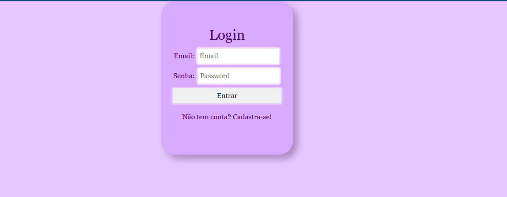

# Formulario de Login

##  Nome
Ketlyn de Melo

##  Descrição da atividade
Este projeto consiste na criação de uma tela de login utilizando HTML, CSS e JavaScript.

O sistema permite:
- Inserir e-mail e senha
- Alternar entre login e cadastro
- Validação básica dos campos
- Armazenamento de dados usando localStorage

## Print 
!